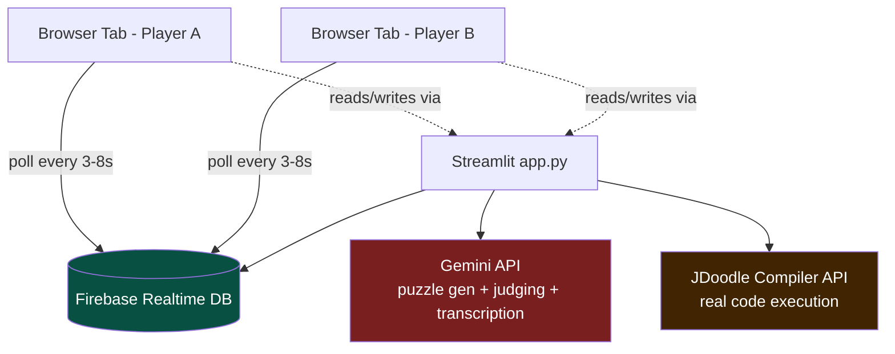
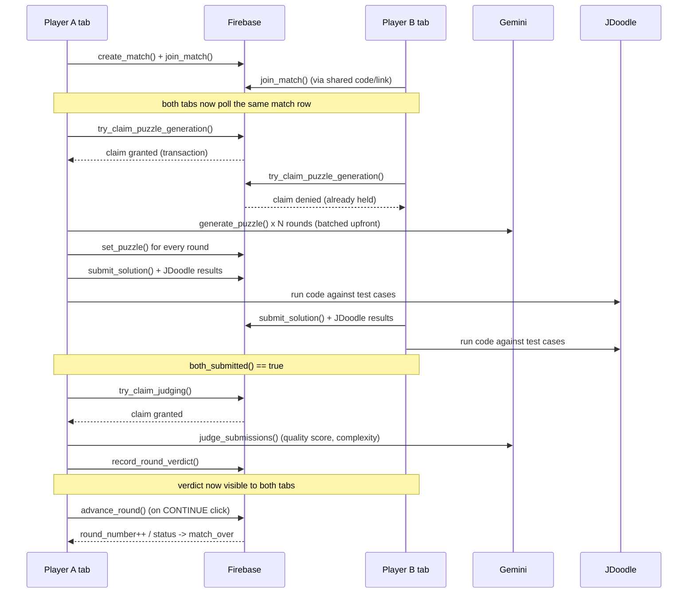

# Architecture

## System overview



**Why Firebase and not in-memory state:** Streamlit has no websockets and
no cross-session memory — every browser tab that loads the app is a fully
independent script execution. Two players can only "know" about each other
by reading and writing the same external row. Firebase Realtime Database
was chosen because its `.transaction()` primitive gives atomic
read-modify-write, which is what makes the race-condition guards below
possible at all.

**Why polling and not websockets:** Streamlit's execution model reruns the
whole script top-to-bottom on every interaction. `streamlit-autorefresh`
simulates push updates by triggering a rerun on a timer, so each tab
re-fetches the shared Firebase row every few seconds and re-renders based
on whatever it finds.

---

## Round lifecycle (sequence)



Only ONE of the two tabs ever actually calls Gemini/JDoodle for a given
step — whichever wins the Firebase transaction. The other tab just polls
until the result appears. This is the difference between "2 API calls per
step" and "4 API calls per step, half of them wasted, plus two different
puzzles being generated for the same round."

---

## Data model (Firebase Realtime DB)

```
/players/{name}
    rating, wins, losses, matches_played
    history/{push_id}: {rating, result, match_id, ts}   # for the rating-over-time chart

/matches/{match_id}
    problem_type, language, status, rounds_total, round_number, created_at
    players: {name: {rating, city, lat, lon}}            # per-match snapshot
    round_wins: {name: count}
    puzzle_generation_claimed_by / _at
    rating_claimed_by / _at
    rounds/
        r1: {puzzle, submissions, test_results, verdict, judging_claimed_by, judging_claimed_at}
        r2: {...}
    final_ratings: {name: new_rating}
```

Round keys are `"r1"`, `"r2"`, ... rather than plain integers — Firebase
silently converts a node into a JSON array when every child key is a plain
integer string, which produces off-by-one bugs on read. Prefixing the key
avoids the coercion entirely.

---

## Concurrency model

Three independent operations need "exactly one of the two tabs does this,"
enforced identically via a shared `_try_claim()` helper built on Firebase
transactions:

1. **Puzzle generation** — one Gemini call batch-generates every round's
   puzzle at match start, not per-round.
2. **Judging** — one Gemini call scores a round once both players submit.
3. **Rating application** — Elo updates apply exactly once per match.

Each claim has a staleness timeout (20s for judging/rating, 180s for
puzzle generation since it's now a multi-round batch) so a crashed or
interrupted session can't permanently deadlock a match — the other tab's
next poll detects the stale claim, releases it, and retries.

A second mechanism — the busy-flag / two-phase rerun pattern documented at
the top of `app.py` — exists because `st_autorefresh`'s timer runs on
wall-clock time independent of the Python script. A slow Gemini/JDoodle
call starting in the same script pass that sets its own "I'm busy, slow
down polling" flag doesn't actually benefit from that flag until the
*next* run — so every slow call is split into two passes: one that only
sets the flag and reruns, and a second that does the actual slow work
once the slower poll interval is already in effect.
